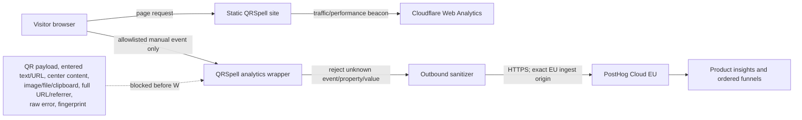

# Analytics architecture and privacy data contract v1

- Status: **production configuration approved/enabled on the feature branch; live rollout verification pending deployment**
- Decision date: 2026-09-28
- Scope: QRSpell public website and browser QR Generator
- Tracking issue: [#40](https://github.com/Peerapat-J/qrspell/issues/40)
- Current schema: [`event-schema-v2.json`](event-schema-v2.json); [v1](event-schema-v1.json)
  is retained for historical validation.

Schema v2 (2026-09-30) adds four bounded boolean warning categories to
`qr_generation_completed` for issue #46. It does not add identity, storage,
autocapture, or free-form values. The #40 sandbox record validates v1 only.
The v2 provider evidence is recorded in `schema-v2-validation.md`. The new
fields are derived only from the four already displayed warning conditions;
the dated provider review records the collection configuration and the owner's
2026-10-05 approval to proceed. Production delivery and dashboard verification
follow deployment; approval does not claim those live checks are complete.

## Decision

Use two deliberately separate analytics systems:

1. **Cloudflare Web Analytics** remains the traffic and performance baseline.
2. **PostHog Cloud EU** is the selected product-event provider, subject to the
   production gates below.

PostHog is a **conditional Go** for production. It becomes Go only after the
non-production validation record proves that the approved events, properties,
funnel, storage behavior, and final network envelopes match this contract. A
failure that cannot be corrected without weakening this contract is a No-go;
Plausible is the first hosted fallback and Umami is the first self-hostable
fallback.

No production event may be sent as part of #40.

## Why PostHog

| Requirement | PostHog Cloud EU | Plausible Cloud | Umami Cloud/self-hosted |
| --- | --- | --- | --- |
| Ordered product funnels | Native event funnels with step ordering | Funnels are built from configured goals | Funnels are available in Insights |
| Property breakdowns | Native event-property breakdowns | Supported; custom properties are a paid Business feature | Supported through event data |
| Cookieless mode | Server-side daily hash mode | Cookie-free analytics | Cookie-free analytics |
| EU-hosted managed option | Yes | Yes | EU and US Cloud; self-hosting is also available |
| Fit for Generator quality events | Strong | Possible, but goal-oriented setup adds friction | Possible, but creates hosting/operations work if self-hosted |
| Main privacy risk | Rich SDK defaults must be explicitly disabled | URL-centric defaults need request transformation for this contract | Broad event-data types require equally strict local validation |

PostHog was selected because the required ordered funnels and low-cardinality
property analysis are available in the existing free sandbox while still
allowing a strict manual-event-only configuration. Selection does not approve
PostHog's default snippet or automatic capture features.

Sources reviewed on 2026-09-28:

- [PostHog cookieless tracking](https://posthog.com/tutorials/cookieless-tracking)
- [PostHog product analytics and funnels](https://posthog.com/product-analytics)
- [PostHog data storage](https://posthog.com/docs/privacy/data-storage)
- [PostHog DPA](https://posthog.com/dpa)
- [PostHog pricing and retention](https://posthog.com/pricing)
- [Plausible custom events](https://plausible.io/docs/custom-event-goals)
- [Plausible custom properties](https://plausible.io/docs/custom-props/introduction)
- [Umami product overview](https://docs.umami.is/docs/about)
- [Umami event data](https://docs.umami.is/docs/event-data)

## Provider responsibilities

Cloudflare and PostHog answer different questions. Their counts are not
interchangeable.

| Question | Provider | Rule |
| --- | --- | --- |
| How much website traffic/performance was observed? | Cloudflare | Use only Cloudflare values |
| Did an observed Generator visit start editing? | PostHog | Both funnel steps must be PostHog events |
| Did an observed Generator start lead to an export? | PostHog | Both funnel steps must be PostHog events |
| Did an observed Generator visit lead to an App Store click? | PostHog | Both funnel steps must be PostHog events |
| How many total visitors converted? | Neither | Not answerable by mixing providers |

Tracker blockers, network failures, DNT/GPC, and the local analytics opt-out can
remove PostHog observations. PostHog therefore represents **observed events**,
not total traffic or an unbiased sample.

## Data flow



The analytics path must fail open: blocking, timeout, HTTP failure, or SDK
failure must not change page navigation, Generator rendering, verification,
Copy, Download, or Reset.

## Identity, persistence, and aggregation

The approved PostHog configuration is:

```js
{
    api_host: "https://eu.i.posthog.com",
    ui_host: "https://eu.posthog.com",
    cookieless_mode: "always",
    person_profiles: "never",
    autocapture: false,
    capture_pageview: false,
    capture_pageleave: false,
    capture_exceptions: false,
    disable_session_recording: true,
    disable_surveys: true,
    disable_external_dependency_loading: true,
    advanced_disable_flags: true,
    save_campaign_params: false,
    save_referrer: false,
    respect_dnt: true,
    before_send: sanitizeAgainstSchemaV1
}
```

The implementation must not call `identify()`, `alias()`, person-property APIs,
feature-flag APIs, or persistence registration APIs. It must not create a
stable visitor identifier. The `before_send` hook must rebuild every outbound
event from the closed schema and retain only the provider transport fields in
`provider_transport_property_allowlist`. In particular it strips PostHog's
automatically enriched URL, referrer, browser, OS, device, viewport, and session
properties. It must also set `$geoip_disable: true` on every event as a
defense-in-depth processing control. Provider-added properties must still be
inspected at the final network boundary; wrapper input validation alone is
insufficient. The validation sandbox sets `disable_compression: true` only to
make that audit readable in DevTools. Production may use the SDK's default
transport compression after the final request envelope has passed this gate.

PostHog cookieless mode derives an ephemeral server-side ID from a daily salt,
project, IP address, user agent, and hostname, then strips the IP before later
transformations. Consequences:

- the same browser normally appears as a different person on a later day;
- weekly/monthly unique-person counts are not exact;
- different people behind the same IP and user agent can collide;
- GeoIP and IP-based bot enrichment are unavailable;
- session replay and surveys remain out of scope.

## Consent and opt-out decision

Version 1 uses no analytics cookie, localStorage, sessionStorage, user account,
or direct identifier and sends only the closed event schema. It therefore does
not show an analytics cookie banner by default.

This is an engineering decision, not a blanket legal conclusion. Before
initialization, the implementation must decline analytics when either:

- `navigator.globalPrivacyControl === true`; or
- the browser exposes Do Not Track as `"1"` or `"yes"`.

The internal analytics record describes the provider, EU region, purposes,
event categories, retention, cookieless daily identity, limitations, and
endpoint-blocking behavior. The public Privacy Policy covers the QRSpell macOS
app; website implementation details belong in these technical documents.
A dedicated persistent opt-out control is
deferred because persisting it would itself require functional browser storage;
revisit this if the site begins using storage for another user-facing setting.

Consent review is reopened before adding stable identity, browser storage,
advertising attribution, session replay, surveys, experiments, or data not in
the current approved schema.

## Retention and deletion

- Product-event retention: **PostHog Free-plan provider terms**, accepted by
  the owner on 2026-10-05. The provider guarantees one year of event retention,
  but may keep data longer in cold storage and does not guarantee deletion by
  month 12. This explicitly replaces the earlier 12-month maximum policy;
  QRSpell must not promise that maximum or treat query date filters as deletion.
  See [the dated review](provider-review-2026-10-05.md). Re-review on plan changes.
- Project sharing decision (2026-10-02): the repository owner selected the
  existing EU project for sandbox and production. Safe sandbox events remain
  subject to the same provider retention terms. Exclude them from every
  production insight and funnel step with `environment = production`, the
  deployed schema version and a date range starting at the production release.
  Environment labels separate queries; settings, retention and usage remain
  shared. No project or historical event deletion is part of this rollout.
- Configuration review: every 90 days and whenever the provider plan changes.
- Provider exit: stop capture first, export only aggregate documentation that
  is still needed, then delete the PostHog project/account data.
- Data-subject deletion: schema v1 and v2 have no user-supplied identity and no stable
  cross-day identifier, so QRSpell cannot reliably locate a person's events.
  Record this limitation in the analytics documentation; do not promise
  per-person deletion that the implementation cannot provide.

PostHog's retention endpoint reports a plan-controlled, read-only window.
The owner accepted the Free plan without a guaranteed maximum deletion bound;
that lack of a 12-month deletion control no longer blocks this release. If a
strict deletion deadline is introduced later, obtain enforceable controls
before claiming it is satisfied.

## Processor and international-transfer boundary

PostHog acts as a processor for the product-event stream. Production approval
requires owner acceptance of the reviewed provider processing boundaries and
recording the applicable subprocessor list. The owner accepted these boundaries
on 2026-10-05. This chat approval is not a signed DPA or a legal-compliance
certification; the dated review distinguishes those actions. EU data residency
controls primary storage location but does
not mean processing never occurs outside the protected area; PostHog's DPA
explicitly describes possible transfers. Record those boundaries in the
analytics documentation without claiming "EU only" or "never leaves the EU."

AI features, destinations, data warehouse imports, ad integrations, reverse
ETL, and external dashboards are not approved for this data set.

## Production gates

The reviewed production configuration can be deployed after the pre-release
checks below. Live production delivery, storage and dashboard canary evidence
is recorded after deployment in `production-rollout.md`, not inferred from
configuration approval:

1. Project is in EU Cloud, timezone is Asia/Bangkok, client IP discard is on,
   and Cookieless tracking is on.
2. The SDK uses the exact configuration above and a pinned/vendored build.
3. The final network canary test finds none of the prohibited data.
4. Raw events contain no GeoIP enrichment, and browser inspection finds no
   analytics/identity cookie scoped to the QRSpell origin and no PostHog key in
   that origin's localStorage or sessionStorage. Existing `.posthog.com`
   dashboard-login cookies in an authenticated test profile are not QRSpell
   analytics storage and must be recorded separately rather than misclassified.
5. The sandbox demonstrates safe page views, custom events and property
   breakdowns. The ordered funnel is configured with approved schema fields;
   fresh production order/count verification follows deployment. Preserve the
   limits of the existing screenshot evidence in the validation record.
6. The current provider retention terms are reviewed and accepted by the owner;
   re-review before changing plans or introducing a maximum deletion promise.
7. DPA/subprocessor review, owner acceptance of the processing boundaries and
   the internal provider/data-handling record are complete. This does not assert
   a signed DPA. The public Privacy Policy continues to cover the macOS app.
8. CSP allows only the exact vendored script and EU ingestion requirements.

Failure of gates 3, 4, 6, or 7 is an automatic No-go. Other failures may be
fixed and retested without weakening the contract.

## Interpretation rules

- `generator_viewed -> generator_started` measures observed acquisition.
- `generator_started -> qr_exported` measures observed activation.
- `generator_viewed -> app_store_clicked` measures observed app interest.
- `qr_generation_completed` is a quality signal, not a deliberate conversion.
- Copy is successful only after the Clipboard API resolves.
- Download means browser download initiation, not confirmed disk persistence.
- App Store click does not mean installation or purchase.
- Every funnel numerator and denominator must come from the same provider.
- Schema or deployment changes require a dated annotation.

## Prohibited data

Never transmit or derive analytics values from:

- QR payloads, entered URLs/text, or content length;
- center text, emoji, image bytes, data URLs, image metadata, or filenames;
- generated SVG/PNG bytes or clipboard contents;
- full URLs, query strings, fragments, or raw referrers;
- DOM text, form values, selection data, or accessibility labels;
- raw errors, error messages, stacks, or console logs;
- IP-derived location, fingerprints, advertising IDs, stable identifiers, or
  payload-derived hashes;
- arbitrary UTM values before a separate bounded attribution decision.

Unknown events, properties, values, objects, arrays, `File`, `Blob`, DOM nodes,
and free-form strings fail closed at the wrapper. Analytics itself always fails
open for product behavior.

## Validation record

[`sandbox-validation.md`](sandbox-validation.md) records the historical v1
check. [`schema-v2-validation.md`](schema-v2-validation.md) records safe
`environment = sandbox` events, automated checks and owner manual results.
Production tracking stayed disabled before owner approval. The owner approved
activation on 2026-10-05 under the revised retention
policy. The feature branch now enables the reviewed EU project; this is not
proof of deployment. Record production delivery and dashboard checks after the
reviewed release as described in [`production-rollout.md`](production-rollout.md).
